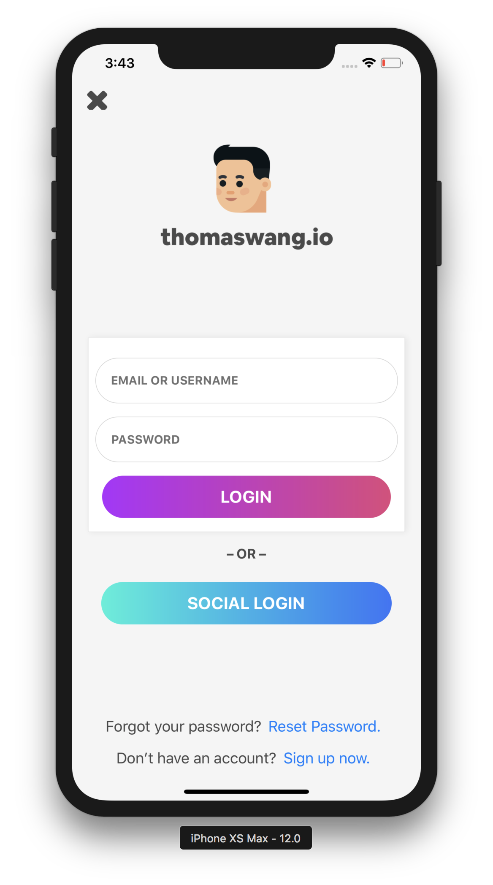
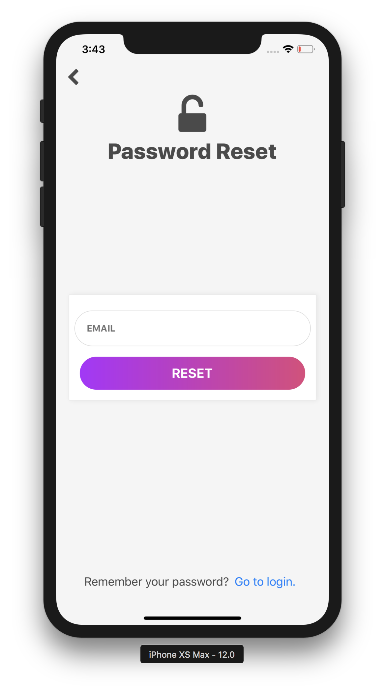
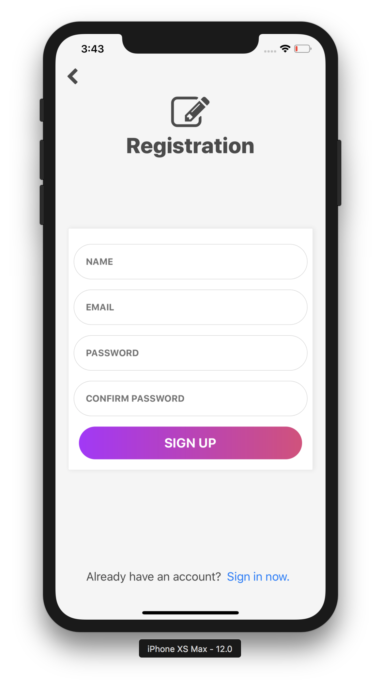

# React Native Auth Screens

An example authentication screen project for React Native showcasing [React Native Gradient Buttons](https://github.com/thomaswangio/react-native-gradient-buttons).

## Installation and Usage

```
$ git clone https://github.com/thomaswangio/auth-screens.git
$ cd auth-screens
$ yarn
$ expo start
```

## Screenshots





